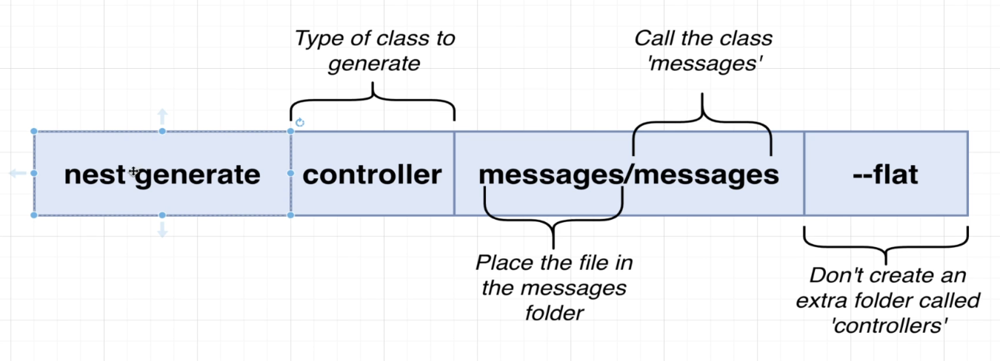

# Learning NestJS - March 2025

Learned some NestJS in 2023.  Decided to return to explore it again, as a potential framework for crafting a serverside app.

Resources:
- Stephen Grider's NestJS course on Udemy: https://www.udemy.com/course/nestjs-the-complete-developers-guide/
  - I'm a big fan of both Udemy & Stephen Grider

## Project generation
- Nest CLI (like many CLI scaffolders) auto-gen a .git dir.  use the `--skip-git` flag to avoid that: `nest new project-name --skip-git`

## Commonly used Design Patterns in NestJS to be familiar with:

- **Dependency Injection** - Core to NestJS, used via `@Injectable()` decorators and constructor injection
- **Module Pattern** - Organizing code into modules with `@Module()` decorators that encapsulate related components
- **Decorator Pattern** - Heavily used for route configuration, middleware, validation, etc. (`@Controller()`, `@Get()`, `@Post()`)
- **Factory Pattern** - As seen in `NestFactory.create()` for application bootstrapping
- **Repository Pattern** - Often used with TypeORM or Mongoose for data access abstraction
- **Provider Pattern** - Services and other injectables that follow the provider pattern
- **Interceptor Pattern** - For implementing cross-cutting concerns using `@UseInterceptors()`
- **Middleware Pattern** - For request processing using `@UseMiddleware()`
- **Pipe Pattern** - For input validation and transformation using `@UsePipes()` 
- **Filter Pattern** - For exception handling via `@UseFilters()`
- **Guard Pattern** - For authentication and authorization using `@UseGuards()`
- **Observer Pattern** - Used in event-based features and microservices
- **Strategy Pattern** - Often used for different validation strategies or authentication methods
- **Singleton Pattern** - The default scope for providers in NestJS

## Nest CLI

- `npm run start:dev`
- `nest new projName`
- `nest generate module moduleName`
- `nest generate controller folderName/className --flat`
  - 


## Nest Decorators

- Class decorators - e.g. @Controller()
- Method decorators - e.g. @Get(), @Post(), etc.
- Argument decorators - e.g. @Body(), @Param()
- Validation decorator or a Property decorator - e.g. @IsString() in a Dto
  >More specifically, it belongs to a category that could be called:
  >- Validation decorators - Because it validates that a property meets certain criteria (in this case, being a string)
  >- Type validation decorators - Since it's specifically validating the type of the property
  >- Class-validator decorators - Named after the library it comes from
---
#### Decorator Examples

Argument Decorator Example:
```js
@Controller('messages')
export class MessagesController {
    @Post()
  createMessage(@Body() body: any) {
    console.log(body);
  }

  @Get('/:id')
  getMessage(@Param('id') id: string) {
    console.log(id);
  }
}
```

## the Injectable decorator

The @Injectable() decorator in NestJS is a key part of its dependency injection system. 

- **What @Injectable() Does** - When you mark a class with @Injectable(), you're telling NestJS that this class can:
  - Have its own dependencies injected (in this case, MessagesRepository)
  - Be injected into other classes (like controllers or other services)

## Class constructor verbose vs shorthand example

The public modifier automatically:
- Creates a class property with the same name
- Assigns the constructor parameter value to that property

**Example:**

```ts
export class MessagesService { ...
// This verbose approach:
  messagesRepo: MessagesRepository;
  constructor(messagesRepo: MessagesRepository) {
    this.messagesRepo = messagesRepo;
  }

// Is equivalent to this shorthand:
  constructor(public messagesRepo: MessagesRepository) {}
```


## TypeORM

I'm new to TypeORM, so I'll keep in mind these aspects it provides:

- Auto-generates:
  - Repository for a given module (Note: It won't generate any sort of visible repository file, it's done behind the scenes)
  - Migration files